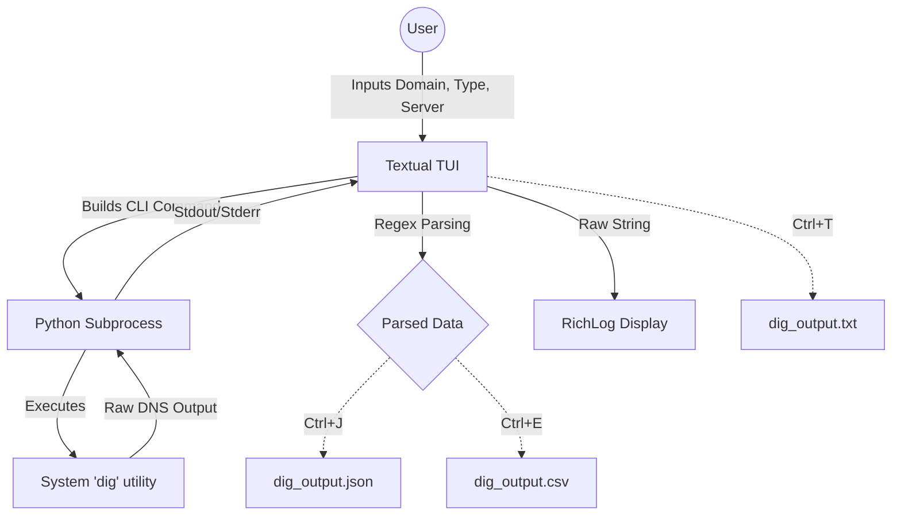

# dig-tui

A modern, fast Terminal User Interface (TUI) for the standard Unix `dig` command, built with Python and [Textual](https://github.com/Textualize/textual).

*A screenshot of the app is pending.*

`dig-tui` provides an interactive way to perform DNS lookups, switch between popular nameservers (Cloudflare, Google, OpenDNS, etc.), and export the structured results to JSON, CSV, or raw text—all without leaving your terminal.

## Features

- **Interactive Interface:** Easily input domains, select record types (A, AAAA, CNAME, MX, NS, TXT, etc.), and choose DNS servers.
- **Custom DNS Servers:** Quickly query against a specific IP address.
- **Persistent Settings:** Remembers your last used domain, record type, and server.
- **Output Parsing:** Automatically parses the `;; ANSWER SECTION:` of the `dig` output into structured data.
- **Data Export:** Export parsed records to JSON or CSV, or save the raw output to a text file using simple keyboard shortcuts.
- **Educational:** Includes a comprehensive [100 Useful `dig` Commands](DIG.md) guide right in the repository.

## Architecture & Workflow



## Prerequisites

- **Python 3.8+**
- **`dig`:** The standard domain information groper utility must be installed on your system.
  - *Ubuntu/Debian:* `sudo apt install dnsutils`
  - *macOS:* Pre-installed (or `brew install bind`)
  - *RHEL/CentOS:* `sudo yum install bind-utils`

## Installation

1. Clone the repository:
   ```bash
   git clone https://github.com/junxit/dig-tui.git
   cd dig-tui
   ```

2. Create a virtual environment (recommended):
   ```bash
   python3 -m venv .venv
   source .venv/bin/activate
   ```

3. Install the requirements:
   ```bash
   pip install -r requirements.txt
   ```

## Usage

Run the application directly:

```bash
python dig-tui.py
```

### Keyboard Shortcuts

| Shortcut | Action | Description |
| :--- | :--- | :--- |
| `Ctrl+J` | Save JSON | Exports the parsed ANSWER SECTION to `dig_output.json` |
| `Ctrl+E` | Save CSV | Exports the parsed ANSWER SECTION to `dig_output.csv` |
| `Ctrl+T` | Save TXT | Exports the raw `dig` output to `dig_output.txt` |
| `Ctrl+Q` | Quit | Exits the application |

## License

This project is licensed under the MIT License - see the [LICENSE](LICENSE) file for details.
