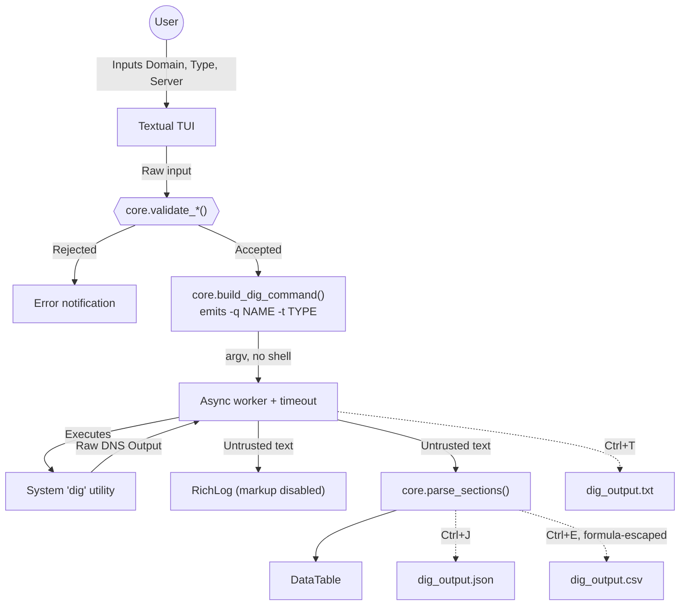

# dig-tui

A modern, fast Terminal User Interface (TUI) for the standard Unix `dig` command, built with Python and [Textual](https://github.com/Textualize/textual).

*A screenshot of the app is pending.*

`dig-tui` provides an interactive way to perform DNS lookups, switch between popular nameservers (Cloudflare, Google, OpenDNS, etc.), and export the structured results to JSON, CSV, or raw text—all without leaving your terminal.

## Features

- **Interactive Interface:** Enter domains, pick from 18 record types (A, AAAA, CNAME, MX, NS, TXT, CAA, DS, DNSKEY, TLSA, SVCB, HTTPS, SSHFP, NAPTR, …), and choose a DNS server.
- **Reverse Lookups & DNSSEC:** Toggle `dig -x` reverse lookups and `+dnssec` from the UI.
- **Custom DNS Servers:** Query a specific IPv4 or IPv6 address.
- **Non-blocking Queries:** Lookups run off the event loop, so the interface stays responsive and a slow nameserver can never freeze the app.
- **Persistent Settings:** Remembers your last used domain, record type, server, and toggles.
- **Structured Results:** Parses the ANSWER, AUTHORITY, and ADDITIONAL sections into a sortable table (`Ctrl+R` toggles raw output vs. table).
- **Data Export:** Export parsed records to JSON or CSV, or save the raw output to text.
- **Educational:** Includes a comprehensive [100 Useful `dig` Commands](DIG.md) guide right in the repository.

## Architecture & Workflow


```mermaid
graph TD;
    User((User)) -->|Inputs Domain, Type, Server| TUI[Textual TUI];
    TUI -->|Raw input| Validate{{"core.validate_*()"}};
    Validate -->|Rejected| Notify[Error notification];
    Validate -->|Accepted| Build["core.build_dig_command()<br/>emits -q NAME -t TYPE"];
    Build -->|argv, no shell| Worker[Async worker + timeout];
    Worker -->|Executes| DigUtility["System 'dig' utility"];
    DigUtility -->|Raw DNS Output| Worker;
    Worker -->|Untrusted text| Log["RichLog (markup disabled)"];
    Worker -->|Untrusted text| Parse["core.parse_sections()"];
    Parse --> Table[DataTable];
    Parse -.->|Ctrl+J| JSON[dig_output.json];
    Parse -.->|Ctrl+E, formula-escaped| CSV[dig_output.csv];
    Worker -.->|Ctrl+T| TXT[dig_output.txt];
```

## Prerequisites

- **Python 3.9+**
- **`dig`:** The standard domain information groper utility must be installed on your system.
  - *Ubuntu/Debian:* `sudo apt install dnsutils`
  - *macOS:* Pre-installed (or `brew install bind`)
  - *RHEL/CentOS:* `sudo yum install bind-utils`

## Installation

```bash
git clone https://github.com/junxit/dig-tui.git
cd dig-tui
uv sync
```

<details>
<summary>Using pip instead of uv</summary>

```bash
python3 -m venv .venv
source .venv/bin/activate
pip install -e .
```

</details>

## Usage

```bash
uv run dig-tui        # or: python -m dig_tui
```

### Keyboard Shortcuts

| Shortcut | Action | Description |
| :--- | :--- | :--- |
| `Ctrl+J` | Save JSON | Exports the parsed records to `dig_output.json` |
| `Ctrl+E` | Save CSV | Exports the parsed records to `dig_output.csv` |
| `Ctrl+T` | Save TXT | Exports the raw `dig` output to `dig_output.txt` |
| `Ctrl+R` | Raw/Table | Switches between raw output and the parsed record table |
| `Ctrl+Q` | Quit | Exits the application |

Exports are written to the current working directory.

## Security

DNS responses are untrusted input — the operator of any domain you look up controls what comes
back — and so is the domain string itself. The following protections are deliberate; each has a
regression test named `test_s1`…`test_s4` in `tests/`.

| | Protection |
| :--- | :--- |
| **S1** | The query name is validated and passed as `dig -q NAME -t TYPE`, never as a positional argument. `dig` parses positional arguments as options and accepts bundled forms like `-f<path>`, which would otherwise let a single crafted string make it read a local file in batch mode and leak it as DNS queries. Custom servers must be IP literals. |
| **S2** | Rich markup is disabled everywhere untrusted output is rendered (`RichLog(markup=False)`, and `Text` objects for table cells). Otherwise a TXT record containing `[link=…]` renders as a clickable hyperlink with attacker-chosen text, and malformed tags raise `MarkupError` and suppress the response. |
| **S3** | CSV exports neutralise leading `=`, `+`, `-`, `@`, tab, and CR so record data cannot execute as a spreadsheet formula. |
| **S4** | `~/.dig-tui-settings.json` is written atomically with `0600` permissions, and is re-validated on load so a tampered file cannot crash the app or smuggle an unvalidated domain into the query field. |

Commands are built as an argv list and executed without a shell.

## Development

```bash
uv sync --extra dev
uv run pytest          # test suite
uv run ruff check .    # lint
uv run ruff format .   # format
```

The codebase splits into `src/dig_tui/core.py` (pure logic — validation, command building,
parsing, exports; fully unit tested) and `src/dig_tui/app.py` (the Textual UI).

## License

This project is licensed under the MIT License - see the [LICENSE](LICENSE) file for details.
